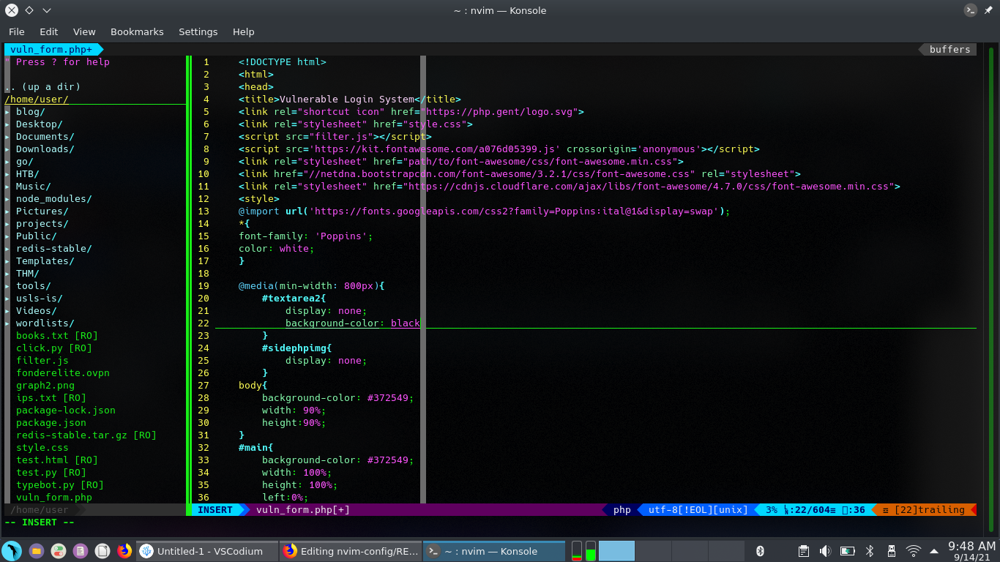

# vim-config
> Config Files for NVIM



## ⬇️ Installation
```bash
┌─[root@parrot]─[/tmp]
└──╼ # git clone https://github.com/FonderElite/nvim-config
----------------------------------------------------------
*Replace the ~/.config/nvim/init.vim with customized init.vim
┌─[root@parrot]─[/tmp]
└──╼ #cat init.vim | tee $HOME/.config/nvim/init.vim
```

# Plugins Installation
```vim
:PlugInstall - Install Plugins
:PlugUpdate - Update Plugins
```

## 🎀 Plugins 
```vim
"""""""""""""""""""""""""""
" Plugins
"""""""""""""""""""""""""""
" Deoplete for autocompletion
Plug 'Shougo/deoplete.nvim', { 'do': ':UpdateRemotePlugins' }
" Python completion integrated in deoplete
Plug 'zchee/deoplete-jedi', { 'for': ['python'] }
" Javascript completion integrated in deoplete
Plug 'carlitux/deoplete-ternjs', { 'for': ['javascript', 'javascript.jsx'] }
" File explorer
Plug 'scrooloose/nerdtree'
" Fuzzy finder
Plug 'junegunn/fzf', { 'dir': '~/.fzf', 'do': './install --all' }
Plug 'junegunn/fzf.vim'
" Quickly comment one or more lines
Plug 'https://github.com/scrooloose/nerdcommenter.git'
" See git additions/removal/updates not comitted yet
Plug 'airblade/vim-gitgutter'
"
Plug 'https://github.com/tpope/vim-fugitive.git'  "'tpope/vim-fugitive.git'
" Used to select pattern with multiple cursors
Plug 'terryma/vim-multiple-cursors'
" Go to character
Plug 'easymotion/vim-easymotion'
" Syntax checker
Plug 'vim-syntastic/syntastic'
"Plug 'w0rp/ale'
" Syntax checker to be used with syntastic for python
Plug 'nvie/vim-flake8'
" Solarized colorscheme
Plug 'altercation/vim-colors-solarized'
" Snippets
Plug 'SirVer/ultisnips' | Plug 'honza/vim-snippets'
" Python related
Plug 'vim-scripts/indentpython.vim'
" Async execution library used by many plugins
Plug 'Shougo/vimproc.vim', {'do' : 'make'}
" Used to grep patterns across files
Plug 'https://github.com/Shougo/unite.vim.git'
" Status line
Plug 'vim-airline/vim-airline'
Plug 'vim-airline/vim-airline-themes'
" display available markers
Plug 'kshenoy/vim-signature'
Plug 'tpope/vim-obsession', { 'do': 'vim -u NONE -c \"helptags vim-obsession/doc\" -c q' }

"Plug 'git@github.com:Valloric/YouCompleteMe.git'
```

## Installing the Plugin Manager
> To make it easier to install plugins, use the Vim-plug plugin manager. This plugin manager uses git to manage most plugins:
```
$curl -fLo ~/.local/share/nvim/site/autoload/plug.vim --create-dirs https://raw.githubusercontent.com/junegunn/vim-plug/master/plug.vim
```

